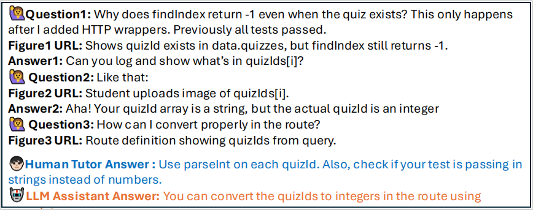

<div align= "center">
    <h1> CSTutorBench </h1>
</div>

## 📊 About CSTutorBench

CSTutorBench consists of 2,970 high-quality question–answer pairs extracted and refined from real conversations between students and human tutors across diverse topics, including technical questions (e.g., programming and algorithms), administrative inquiries (e.g., deadlines and course policies), and meta-cognitive or clarification-seeking interactions.
We benchmark leading LLMs—including GPT-4o, Claude, Llama 4, and others—on this dataset using both automated metrics and expert human evaluations. CSTutorBench provides a foundation for advancing LLM-based educational systems by offering a robust, realistic testbed tailored for the unique demands of tutoring in computer science.  


## 🚀 Quick Start

### 1. Download the Dataset

Please download the dataset from the following link:

📥 [Click here to download the dataset](https://shorturl.at/aFyqQ)
**Note:** 
Please place CSTBrech.json and the Background folder in the same directory as Evaluation.py. 

---

### 2. Complete the TODOs in `Evaluation.py`

Open `Evaluation.py` and fill in the necessary details marked as `TODO`.
**Note:** 
Currently, only API calls in the OpenAI format are supported.

```bash
# TODO Path of your JSON file (the `CSTutorBench.json` dataset obtained from https://shorturl.at/aFyqQ).
input_json = "CSTutorBench.json"
# TODO Path of your output document (in CSV format)
output_csv = "result_GPT-4o.csv"
# TODO API key of the model to be tested
api_key_generate = " "
# TODO API key of the model to evaluate (default is GPT-4o)
api_key_evaluation = " "
# TODO Name of the model to be tested
generate_model = " "
# TODO Name of the model to evaluate (default is GPT-4o)
evaluation_model = "gpt-4o"
# TODO Number of concurrent threads
threads = 1
```
---

### 3. Run `Evaluation.py` and wait for the results

**The result will be a CSV file containing:**   
dialogue ID, category, answers from the human tutor and the LLM tutor,
the LLM's explanation of its scores, scores across five evaluation dimensions, and a weighted sum score.

## 📫 Contact
If you have any questions, feedback, or suggestions, please open an issue or submit a pull request. We'd love to hear from you!  

**Please email >**
[yunfeng.wan@unsw.edu.au](yunfeng.wan@unsw.edu.au)  or [zekai.cheng@student.unsw.edu.au](zekai.cheng@student.unsw.edu.au)
